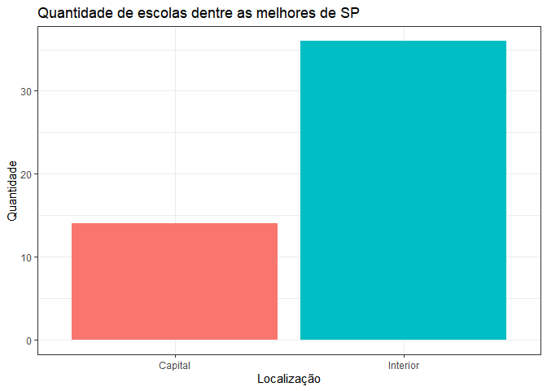

**Sobre o Sistema Educacional e Ambientes - R**
==================================================

O **Exame Nacional do Ensino Médio**, ou
[ENEM](https://www.gov.br/inep/pt-br/areas-de-atuacao/avaliacao-e-exames-educacionais/enem),
ocorre todo ano - desde 1998 - e é a maior prova do Brasil, com cerca de
[5 milhões de inscrições por
ano](http://portal.inep.gov.br/artigo/-/asset_publisher/B4AQV9zFY7Bv/content/5-8-milhoes-estao-inscritos-para-fazer-o-enem-2020/21206#:~:text=Finalizadas%20as%20etapas%20de%20inscri%C3%A7%C3%A3o,Ensino%20M%C3%A9dio%20(Enem)%202020.).   

Nesse último ano, a prova foi um pouco diferente, devido ao coronavírus,
que acarretou em adiação da prova, diversas
[medidas](https://www.gov.br/inep/pt-br/areas-de-atuacao/avaliacao-e-exames-educacionais/enem/orientacoes/medidas-de-prevencao-a-covid-19)
preventivas para a realização do exame e a maior abstenção da história:
[mais da metade dos candidatos não foram realizar o
exame](https://educacao.uol.com.br/noticias/2021/01/17/mec-culpa-medo-da-covid-19-e-midia-contra-por-abstencao-de-515-no-enem.htm). 

De fato, trata-se de uma grande experiência na vida do estudante
brasileiro que busca uma vaga na universidade, visto que o ENEM é uma
porta de entrada para diversas faculdades acerca do país - além de ser o
processo seletivo das universidades federais do Brasil. Diversas
universidades (inclusive públicas), além de seus próprios vestibulares,
oferecem vagas exclusivas para o exame, pelo
[SiSU](https://sisu.mec.gov.br/) (Sistema de Seleção Unificada), e
diversas universidades particulares oferecem bolsas de estudos aos
participantes relativas às suas notas no exame.   

A prova é realizada em dois dias: um reservado para as disciplinas de
Ciências Humanas, Linguagens e a Redação, e outro dia para Matemática e
Ciências da Natureza (atualmente a prova segue sse padrão, mas já foi
diferente, e pode ser diferente no momento de sua leitura).   

Neste artigo, a gente vai explorar um pouco os dados - disponibilizados
pelo próprio [Inep](https://enem.inep.gov.br/participante/), órgão
responsável pelo exame - relativos aos exames de 2007 a 2015 organizados
por escola. Os dados foram baixados neste
[link](https://www.gov.br/inep/pt-br/acesso-a-informacao/dados-abertos/microdados/enem-por-escola).   

É notável, portanto, que a escola em que o candidato estudou tem forte
influência no seu desempenho. Muitas vezes, com um ensino não tão bom em
suas escolas, muitos buscam fazer cursinhos preparatórios para o ENEM.   
Veremos a seguir as relações entre a natureza da escola com o desempenho
de seus estudantes. Como o ambiente influencia no futuro do candidato?
Influencia de fato? Veremos!  

***

## Sumário

1. [Importação do dataset](https://github.com/KenzoBH/Data-Science/blob/main/ENEM/ENEM.md#1-importa%C3%A7%C3%A3o-do-dataset)
2. [Brasil](https://github.com/KenzoBH/Data-Science/blob/main/ENEM/ENEM.md#2-brasil)
    1. [Desempenho por estado: qual o melhor estado em Ciências Humanas?](https://github.com/KenzoBH/Data-Science/blob/main/ENEM/ENEM.md#21-desempenho-por-estado-qual-o-melhor-estado-em-ci%C3%AAncias-humanas)
    2. [Desempenho por tipo administrativo: escolas privadas vão melhor no ENEM?](https://github.com/KenzoBH/Data-Science/blob/main/ENEM/ENEM.md#22-desempenho-por-tipo-administrativo-escolas-privadas-v%C3%A3o-melhor-no-enem)
3. [Sudeste](https://github.com/KenzoBH/Data-Science/blob/main/ENEM/ENEM.md#3-sudeste)
    1. [Desempenho no sudeste: SP é o melhor estado no ENEM?](https://github.com/KenzoBH/Data-Science/blob/main/ENEM/ENEM.md#31-desempenho-no-sudeste-sp-%C3%A9-o-melhor-estado-no-enem)
    2. [Desempenho no sudeste por tipo adminstrativo: como são as federais?](https://github.com/KenzoBH/Data-Science/blob/main/ENEM/ENEM.md#32-desempenho-no-sudeste-por-tipo-adminstrativo-como-s%C3%A3o-as-federais)
4. [São Paulo](https://github.com/KenzoBH/Data-Science/blob/main/ENEM/ENEM.md#4-s%C3%A3o-paulo)
    1. [Desempenho pela localização: escolas urbanas e rurais](https://github.com/KenzoBH/Data-Science/blob/main/ENEM/ENEM.md#4-s%C3%A3o-paulo)
    2. [São Paulo capital: a geografia na nota](https://github.com/KenzoBH/Data-Science/blob/main/ENEM/ENEM.md#4-s%C3%A3o-paulo)
    3. [Sobre as públicas](https://github.com/KenzoBH/Data-Science/blob/main/ENEM/ENEM.md#43-sobre-as-p%C3%BAblicas)
    4. [Sobre as escolas técnicas](https://github.com/KenzoBH/Data-Science/blob/main/ENEM/ENEM.md#44-sobre-as-escolas-t%C3%A9cnicas)    
5. [Conclusão](https://github.com/KenzoBH/Data-Science/blob/main/ENEM/ENEM.md#5-conclus%C3%A3o)

***

## 1. Importação do dataset

Primeiro, vamos importar as bibliotecas que iremos utilizar. A
biblioteca `tidyverse` será responsável pela manipulação e visualização
dos dados, enquanto que a `knitr` apenas para a melhor exposição das
tabelas aqui.

    library(tidyverse)
    library(knitr)

Assim que importadas, podemos fazer a leitura do *dataset*. O arquivo
baixado no site do Inep no link exposto também continham o dicionário
das variáveis, que está disposto mais abaixo, apenas com colunas que
iremos uilizar na nossa análise.

    enem <- read.csv("MICRODADOS_ENEM_ESCOLA.csv", sep=';')
    kable(
      head(enem)
      )

<table style="width:100%;">
<colgroup>
<col style="width: 1%" />
<col style="width: 2%" />
<col style="width: 2%" />
<col style="width: 4%" />
<col style="width: 4%" />
<col style="width: 4%" />
<col style="width: 5%" />
<col style="width: 5%" />
<col style="width: 4%" />
<col style="width: 3%" />
<col style="width: 5%" />
<col style="width: 3%" />
<col style="width: 4%" />
<col style="width: 2%" />
<col style="width: 2%" />
<col style="width: 2%" />
<col style="width: 2%" />
<col style="width: 2%" />
<col style="width: 2%" />
<col style="width: 2%" />
<col style="width: 1%" />
<col style="width: 4%" />
<col style="width: 4%" />
<col style="width: 3%" />
<col style="width: 4%" />
<col style="width: 3%" />
<col style="width: 4%" />
</colgroup>
<thead>
<tr class="header">
<th style="text-align: right;">NU_ANO</th>
<th style="text-align: right;">CO_UF_ESCOLA</th>
<th style="text-align: left;">SG_UF_ESCOLA</th>
<th style="text-align: right;">CO_MUNICIPIO_ESCOLA</th>
<th style="text-align: left;">NO_MUNICIPIO_ESCOLA</th>
<th style="text-align: right;">CO_ESCOLA_EDUCACENSO</th>
<th style="text-align: left;">NO_ESCOLA_EDUCACENSO</th>
<th style="text-align: right;">TP_DEPENDENCIA_ADM_ESCOLA</th>
<th style="text-align: right;">TP_LOCALIZACAO_ESCOLA</th>
<th style="text-align: right;">NU_MATRICULAS</th>
<th style="text-align: right;">NU_PARTICIPANTES_NEC_ESP</th>
<th style="text-align: right;">NU_PARTICIPANTES</th>
<th style="text-align: right;">NU_TAXA_PARTICIPACAO</th>
<th style="text-align: right;">NU_MEDIA_CN</th>
<th style="text-align: right;">NU_MEDIA_CH</th>
<th style="text-align: right;">NU_MEDIA_LP</th>
<th style="text-align: right;">NU_MEDIA_MT</th>
<th style="text-align: right;">NU_MEDIA_RED</th>
<th style="text-align: right;">NU_MEDIA_OBJ</th>
<th style="text-align: right;">NU_MEDIA_TOT</th>
<th style="text-align: left;">INSE</th>
<th style="text-align: right;">PC_FORMACAO_DOCENTE</th>
<th style="text-align: right;">NU_TAXA_PERMANENCIA</th>
<th style="text-align: right;">NU_TAXA_APROVACAO</th>
<th style="text-align: right;">NU_TAXA_REPROVACAO</th>
<th style="text-align: right;">NU_TAXA_ABANDONO</th>
<th style="text-align: left;">PORTE_ESCOLA</th>
</tr>
</thead>
<tbody>
<tr class="odd">
<td style="text-align: right;">2007</td>
<td style="text-align: right;">11</td>
<td style="text-align: left;">RO</td>
<td style="text-align: right;">1100205</td>
<td style="text-align: left;">Porto Velho</td>
<td style="text-align: right;">11000058</td>
<td style="text-align: left;">CENTRO DE ENSINO CLASSE A</td>
<td style="text-align: right;">4</td>
<td style="text-align: right;">1</td>
<td style="text-align: right;">144</td>
<td style="text-align: right;">NA</td>
<td style="text-align: right;">140</td>
<td style="text-align: right;">NA</td>
<td style="text-align: right;">NA</td>
<td style="text-align: right;">NA</td>
<td style="text-align: right;">NA</td>
<td style="text-align: right;">NA</td>
<td style="text-align: right;">NA</td>
<td style="text-align: right;">NA</td>
<td style="text-align: right;">69.03</td>
<td style="text-align: left;"></td>
<td style="text-align: right;">NA</td>
<td style="text-align: right;">NA</td>
<td style="text-align: right;">91.9</td>
<td style="text-align: right;">8.1</td>
<td style="text-align: right;">0.0</td>
<td style="text-align: left;">Maior que 90 alunos</td>
</tr>
<tr class="even">
<td style="text-align: right;">2006</td>
<td style="text-align: right;">11</td>
<td style="text-align: left;">RO</td>
<td style="text-align: right;">1100205</td>
<td style="text-align: left;">Porto Velho</td>
<td style="text-align: right;">11000058</td>
<td style="text-align: left;">CENTRO DE ENSINO CLASSE A</td>
<td style="text-align: right;">4</td>
<td style="text-align: right;">1</td>
<td style="text-align: right;">184</td>
<td style="text-align: right;">NA</td>
<td style="text-align: right;">139</td>
<td style="text-align: right;">NA</td>
<td style="text-align: right;">NA</td>
<td style="text-align: right;">NA</td>
<td style="text-align: right;">NA</td>
<td style="text-align: right;">NA</td>
<td style="text-align: right;">NA</td>
<td style="text-align: right;">NA</td>
<td style="text-align: right;">57.82</td>
<td style="text-align: left;"></td>
<td style="text-align: right;">NA</td>
<td style="text-align: right;">NA</td>
<td style="text-align: right;">NA</td>
<td style="text-align: right;">NA</td>
<td style="text-align: right;">NA</td>
<td style="text-align: left;">Maior que 90 alunos</td>
</tr>
<tr class="odd">
<td style="text-align: right;">2005</td>
<td style="text-align: right;">11</td>
<td style="text-align: left;">RO</td>
<td style="text-align: right;">1100205</td>
<td style="text-align: left;">Porto Velho</td>
<td style="text-align: right;">11000058</td>
<td style="text-align: left;">CENTRO DE ENSINO CLASSE A</td>
<td style="text-align: right;">4</td>
<td style="text-align: right;">1</td>
<td style="text-align: right;">220</td>
<td style="text-align: right;">NA</td>
<td style="text-align: right;">145</td>
<td style="text-align: right;">NA</td>
<td style="text-align: right;">NA</td>
<td style="text-align: right;">NA</td>
<td style="text-align: right;">NA</td>
<td style="text-align: right;">NA</td>
<td style="text-align: right;">NA</td>
<td style="text-align: right;">NA</td>
<td style="text-align: right;">64.83</td>
<td style="text-align: left;"></td>
<td style="text-align: right;">NA</td>
<td style="text-align: right;">NA</td>
<td style="text-align: right;">86.5</td>
<td style="text-align: right;">12.4</td>
<td style="text-align: right;">1.1</td>
<td style="text-align: left;">Maior que 90 alunos</td>
</tr>
<tr class="even">
<td style="text-align: right;">2008</td>
<td style="text-align: right;">11</td>
<td style="text-align: left;">RO</td>
<td style="text-align: right;">1100205</td>
<td style="text-align: left;">Porto Velho</td>
<td style="text-align: right;">11000058</td>
<td style="text-align: left;">CENTRO DE ENSINO CLASSE A</td>
<td style="text-align: right;">4</td>
<td style="text-align: right;">1</td>
<td style="text-align: right;">186</td>
<td style="text-align: right;">NA</td>
<td style="text-align: right;">171</td>
<td style="text-align: right;">NA</td>
<td style="text-align: right;">NA</td>
<td style="text-align: right;">NA</td>
<td style="text-align: right;">NA</td>
<td style="text-align: right;">NA</td>
<td style="text-align: right;">72.16</td>
<td style="text-align: right;">60.02</td>
<td style="text-align: right;">NA</td>
<td style="text-align: left;"></td>
<td style="text-align: right;">NA</td>
<td style="text-align: right;">NA</td>
<td style="text-align: right;">90.3</td>
<td style="text-align: right;">9.7</td>
<td style="text-align: right;">0.0</td>
<td style="text-align: left;">Maior que 90 alunos</td>
</tr>
<tr class="odd">
<td style="text-align: right;">2007</td>
<td style="text-align: right;">11</td>
<td style="text-align: left;">RO</td>
<td style="text-align: right;">1100205</td>
<td style="text-align: left;">Porto Velho</td>
<td style="text-align: right;">11000171</td>
<td style="text-align: left;">CENTRO EDUCACIONAL MOJUCA</td>
<td style="text-align: right;">4</td>
<td style="text-align: right;">1</td>
<td style="text-align: right;">19</td>
<td style="text-align: right;">NA</td>
<td style="text-align: right;">12</td>
<td style="text-align: right;">NA</td>
<td style="text-align: right;">NA</td>
<td style="text-align: right;">NA</td>
<td style="text-align: right;">NA</td>
<td style="text-align: right;">NA</td>
<td style="text-align: right;">NA</td>
<td style="text-align: right;">NA</td>
<td style="text-align: right;">58.84</td>
<td style="text-align: left;"></td>
<td style="text-align: right;">NA</td>
<td style="text-align: right;">NA</td>
<td style="text-align: right;">74.2</td>
<td style="text-align: right;">21.0</td>
<td style="text-align: right;">4.8</td>
<td style="text-align: left;">De 1 a 30 alunos</td>
</tr>
<tr class="even">
<td style="text-align: right;">2008</td>
<td style="text-align: right;">11</td>
<td style="text-align: left;">RO</td>
<td style="text-align: right;">1100205</td>
<td style="text-align: left;">Porto Velho</td>
<td style="text-align: right;">11000171</td>
<td style="text-align: left;">CENTRO EDUCACIONAL MOJUCA</td>
<td style="text-align: right;">4</td>
<td style="text-align: right;">1</td>
<td style="text-align: right;">33</td>
<td style="text-align: right;">NA</td>
<td style="text-align: right;">13</td>
<td style="text-align: right;">NA</td>
<td style="text-align: right;">NA</td>
<td style="text-align: right;">NA</td>
<td style="text-align: right;">NA</td>
<td style="text-align: right;">NA</td>
<td style="text-align: right;">59.81</td>
<td style="text-align: right;">42.49</td>
<td style="text-align: right;">NA</td>
<td style="text-align: left;"></td>
<td style="text-align: right;">NA</td>
<td style="text-align: right;">NA</td>
<td style="text-align: right;">79.1</td>
<td style="text-align: right;">17.9</td>
<td style="text-align: right;">3.0</td>
<td style="text-align: left;">De 31 a 60 alunos</td>
</tr>
</tbody>
</table>

Irei verificar a proporção de dados faltantes (`NA`) em cada coluna com
um laço `for`. Irei imprimir aquelas em que a proporção ultrapassa os
70%.

    for (i in 1:length(enem)){
      prop_na = (sum(is.na(enem[i]))/length(enem[[i]])) * 100 # calculo da proporção em %
      if (prop_na > 70) {
      print(str_c(names(enem)[i], " = ", (prop_na)))
      }
    }

    ## [1] "NU_PARTICIPANTES_NEC_ESP = 73.6774904965033"
    ## [1] "NU_MEDIA_OBJ = 88.8894692551"
    ## [1] "NU_MEDIA_TOT = 71.8673282841473"
    ## [1] "PC_FORMACAO_DOCENTE = 73.6978033138911"
    ## [1] "NU_TAXA_PERMANENCIA = 82.08119323293"

Irei selecionar apenas algumas colunas para nossa análise.

    enem <- select(enem,
                   -NU_PARTICIPANTES_NEC_ESP, -NU_MEDIA_OBJ, -NU_MEDIA_TOT,
                   -PC_FORMACAO_DOCENTE, -NU_TAXA_PERMANENCIA,
                   -CO_MUNICIPIO_ESCOLA, -CO_ESCOLA_EDUCACENSO, -NU_MATRICULAS, 
                   -NU_PARTICIPANTES, -NU_TAXA_PARTICIPACAO, -INSE, -NU_TAXA_APROVACAO,
                   -NU_TAXA_REPROVACAO, -NU_TAXA_ABANDONO, -PORTE_ESCOLA
                   )
    kable(
      head(enem)
      )

<table>
<colgroup>
<col style="width: 3%" />
<col style="width: 6%" />
<col style="width: 6%" />
<col style="width: 10%" />
<col style="width: 13%" />
<col style="width: 13%" />
<col style="width: 11%" />
<col style="width: 6%" />
<col style="width: 6%" />
<col style="width: 6%" />
<col style="width: 6%" />
<col style="width: 6%" />
</colgroup>
<thead>
<tr class="header">
<th style="text-align: right;">NU_ANO</th>
<th style="text-align: right;">CO_UF_ESCOLA</th>
<th style="text-align: left;">SG_UF_ESCOLA</th>
<th style="text-align: left;">NO_MUNICIPIO_ESCOLA</th>
<th style="text-align: left;">NO_ESCOLA_EDUCACENSO</th>
<th style="text-align: right;">TP_DEPENDENCIA_ADM_ESCOLA</th>
<th style="text-align: right;">TP_LOCALIZACAO_ESCOLA</th>
<th style="text-align: right;">NU_MEDIA_CN</th>
<th style="text-align: right;">NU_MEDIA_CH</th>
<th style="text-align: right;">NU_MEDIA_LP</th>
<th style="text-align: right;">NU_MEDIA_MT</th>
<th style="text-align: right;">NU_MEDIA_RED</th>
</tr>
</thead>
<tbody>
<tr class="odd">
<td style="text-align: right;">2007</td>
<td style="text-align: right;">11</td>
<td style="text-align: left;">RO</td>
<td style="text-align: left;">Porto Velho</td>
<td style="text-align: left;">CENTRO DE ENSINO CLASSE A</td>
<td style="text-align: right;">4</td>
<td style="text-align: right;">1</td>
<td style="text-align: right;">NA</td>
<td style="text-align: right;">NA</td>
<td style="text-align: right;">NA</td>
<td style="text-align: right;">NA</td>
<td style="text-align: right;">NA</td>
</tr>
<tr class="even">
<td style="text-align: right;">2006</td>
<td style="text-align: right;">11</td>
<td style="text-align: left;">RO</td>
<td style="text-align: left;">Porto Velho</td>
<td style="text-align: left;">CENTRO DE ENSINO CLASSE A</td>
<td style="text-align: right;">4</td>
<td style="text-align: right;">1</td>
<td style="text-align: right;">NA</td>
<td style="text-align: right;">NA</td>
<td style="text-align: right;">NA</td>
<td style="text-align: right;">NA</td>
<td style="text-align: right;">NA</td>
</tr>
<tr class="odd">
<td style="text-align: right;">2005</td>
<td style="text-align: right;">11</td>
<td style="text-align: left;">RO</td>
<td style="text-align: left;">Porto Velho</td>
<td style="text-align: left;">CENTRO DE ENSINO CLASSE A</td>
<td style="text-align: right;">4</td>
<td style="text-align: right;">1</td>
<td style="text-align: right;">NA</td>
<td style="text-align: right;">NA</td>
<td style="text-align: right;">NA</td>
<td style="text-align: right;">NA</td>
<td style="text-align: right;">NA</td>
</tr>
<tr class="even">
<td style="text-align: right;">2008</td>
<td style="text-align: right;">11</td>
<td style="text-align: left;">RO</td>
<td style="text-align: left;">Porto Velho</td>
<td style="text-align: left;">CENTRO DE ENSINO CLASSE A</td>
<td style="text-align: right;">4</td>
<td style="text-align: right;">1</td>
<td style="text-align: right;">NA</td>
<td style="text-align: right;">NA</td>
<td style="text-align: right;">NA</td>
<td style="text-align: right;">NA</td>
<td style="text-align: right;">72.16</td>
</tr>
<tr class="odd">
<td style="text-align: right;">2007</td>
<td style="text-align: right;">11</td>
<td style="text-align: left;">RO</td>
<td style="text-align: left;">Porto Velho</td>
<td style="text-align: left;">CENTRO EDUCACIONAL MOJUCA</td>
<td style="text-align: right;">4</td>
<td style="text-align: right;">1</td>
<td style="text-align: right;">NA</td>
<td style="text-align: right;">NA</td>
<td style="text-align: right;">NA</td>
<td style="text-align: right;">NA</td>
<td style="text-align: right;">NA</td>
</tr>
<tr class="even">
<td style="text-align: right;">2008</td>
<td style="text-align: right;">11</td>
<td style="text-align: left;">RO</td>
<td style="text-align: left;">Porto Velho</td>
<td style="text-align: left;">CENTRO EDUCACIONAL MOJUCA</td>
<td style="text-align: right;">4</td>
<td style="text-align: right;">1</td>
<td style="text-align: right;">NA</td>
<td style="text-align: right;">NA</td>
<td style="text-align: right;">NA</td>
<td style="text-align: right;">NA</td>
<td style="text-align: right;">59.81</td>
</tr>
</tbody>
</table>

-   **NU\_ANO**: Ano da edição do ENEM por Escola.
-   **SG\_UF\_ESCOLA**: Sigla da Unidade da Federação da escola.
-   **NO\_MUNICIPIO\_ESCOLA**: Nome do município da escola.
-   **NO\_ESCOLA\_EDUCACENSO**: Nome da Escola no Educacenso do ano
    anterior.
-   **TP\_DEPENDENCIA\_ADM\_ESCOLA**: Tipo da dependência administrativa
    da entidade (Escola) do Educacenso.
    -   1 - Federal,
    -   2 - Estadual,
    -   3 - Municipal,
    -   4 - Privada.
-   **TP\_LOCALIZACAO\_ESCOLA**: Tipo de Localização da escola.
    -   1 - Urbana,
    -   2 - Rural.
-   **NU\_MEDIA\_CN**: Média das notas de Ciências da Natureza do Ensino
    Médio Regular.
-   **NU\_MEDIA\_CH**: Média das notas de Ciências Humanas do Ensino
    Médio Regular.
-   **NU\_MEDIA\_LP**: Média das notas de Linguagens e Códigos do Ensino
    Médio Regular.
-   **NU\_MEDIA\_MT**: Média das notas de Matemática do Ensino Médio
    Regular.
-   **NU\_MEDIA\_RED**: Média das notas de Redação do Ensino Médio
    Regular.

Como iremos fazer a análise apenas do ENEM 2015, irei filtrar a coluna
“NU\_ANO” para recuperar as observações, que correspondem a uma escola, referentes apenas ao desempenho no exame de 2015. Nosso novo
*dataframe* será chamado de `enem2015`.

    enem2015 <- filter(enem, NU_ANO == 2015)
    kable(
      head(enem2015)
      )

<table>
<colgroup>
<col style="width: 2%" />
<col style="width: 5%" />
<col style="width: 5%" />
<col style="width: 8%" />
<col style="width: 32%" />
<col style="width: 10%" />
<col style="width: 9%" />
<col style="width: 5%" />
<col style="width: 5%" />
<col style="width: 5%" />
<col style="width: 5%" />
<col style="width: 5%" />
</colgroup>
<thead>
<tr class="header">
<th style="text-align: right;">NU_ANO</th>
<th style="text-align: right;">CO_UF_ESCOLA</th>
<th style="text-align: left;">SG_UF_ESCOLA</th>
<th style="text-align: left;">NO_MUNICIPIO_ESCOLA</th>
<th style="text-align: left;">NO_ESCOLA_EDUCACENSO</th>
<th style="text-align: right;">TP_DEPENDENCIA_ADM_ESCOLA</th>
<th style="text-align: right;">TP_LOCALIZACAO_ESCOLA</th>
<th style="text-align: right;">NU_MEDIA_CN</th>
<th style="text-align: right;">NU_MEDIA_CH</th>
<th style="text-align: right;">NU_MEDIA_LP</th>
<th style="text-align: right;">NU_MEDIA_MT</th>
<th style="text-align: right;">NU_MEDIA_RED</th>
</tr>
</thead>
<tbody>
<tr class="odd">
<td style="text-align: right;">2015</td>
<td style="text-align: right;">11</td>
<td style="text-align: left;">RO</td>
<td style="text-align: left;">Porto Velho</td>
<td style="text-align: left;">CENTRO DE ENSINO CLASSE A</td>
<td style="text-align: right;">4</td>
<td style="text-align: right;">1</td>
<td style="text-align: right;">591.64</td>
<td style="text-align: right;">652.34</td>
<td style="text-align: right;">604.53</td>
<td style="text-align: right;">627.66</td>
<td style="text-align: right;">732.00</td>
</tr>
<tr class="even">
<td style="text-align: right;">2015</td>
<td style="text-align: right;">11</td>
<td style="text-align: left;">RO</td>
<td style="text-align: left;">Porto Velho</td>
<td style="text-align: left;">CENTRO EDUCACIONAL MOJUCA</td>
<td style="text-align: right;">4</td>
<td style="text-align: right;">1</td>
<td style="text-align: right;">458.46</td>
<td style="text-align: right;">533.51</td>
<td style="text-align: right;">472.62</td>
<td style="text-align: right;">459.72</td>
<td style="text-align: right;">507.82</td>
</tr>
<tr class="odd">
<td style="text-align: right;">2015</td>
<td style="text-align: right;">11</td>
<td style="text-align: left;">RO</td>
<td style="text-align: left;">Porto Velho</td>
<td style="text-align: left;">CENTRO EDUCACIONAL OBJETIVO</td>
<td style="text-align: right;">4</td>
<td style="text-align: right;">1</td>
<td style="text-align: right;">529.05</td>
<td style="text-align: right;">583.87</td>
<td style="text-align: right;">547.11</td>
<td style="text-align: right;">507.22</td>
<td style="text-align: right;">652.43</td>
</tr>
<tr class="even">
<td style="text-align: right;">2015</td>
<td style="text-align: right;">11</td>
<td style="text-align: left;">RO</td>
<td style="text-align: left;">Porto Velho</td>
<td style="text-align: left;">COLEGIO DOM BOSCO</td>
<td style="text-align: right;">4</td>
<td style="text-align: right;">1</td>
<td style="text-align: right;">508.74</td>
<td style="text-align: right;">586.45</td>
<td style="text-align: right;">531.35</td>
<td style="text-align: right;">529.87</td>
<td style="text-align: right;">591.84</td>
</tr>
<tr class="odd">
<td style="text-align: right;">2015</td>
<td style="text-align: right;">11</td>
<td style="text-align: left;">RO</td>
<td style="text-align: left;">Porto Velho</td>
<td style="text-align: left;">CENTRO EDUCACIONAL OBJETIVO - UNIDADE JARDIM AMERICA</td>
<td style="text-align: right;">4</td>
<td style="text-align: right;">1</td>
<td style="text-align: right;">523.38</td>
<td style="text-align: right;">591.66</td>
<td style="text-align: right;">563.45</td>
<td style="text-align: right;">528.93</td>
<td style="text-align: right;">583.48</td>
</tr>
<tr class="even">
<td style="text-align: right;">2015</td>
<td style="text-align: right;">11</td>
<td style="text-align: left;">RO</td>
<td style="text-align: left;">Porto Velho</td>
<td style="text-align: left;">COLEGIO TIRADENTES DA POLICIA MILITAR DO ESTADO DE RONDONIA EEEFM TIRADENTES</td>
<td style="text-align: right;">2</td>
<td style="text-align: right;">1</td>
<td style="text-align: right;">505.77</td>
<td style="text-align: right;">582.16</td>
<td style="text-align: right;">527.39</td>
<td style="text-align: right;">492.85</td>
<td style="text-align: right;">580.83</td>
</tr>
</tbody>
</table>

Dados prontos! (Na verdade, ainda não: veremos que algumas colunas ainda deverão ser manipuladas).

***

## 2. Brasil

Agora, vamos comparar desempenho do país inteiro nessa edição do ENEM. Começaremos com a média da nota em Ciências Humanas. 

### 2.1. Desempenho por estado: qual o melhor estado em Ciências Humanas?

Como se dá as médias dos estados na prova de Ciências
Humanas? Quais suas expectativas?

    kable(
      enem2015 %>% 
        group_by(SG_UF_ESCOLA) %>% 
        summarise(MED_HUM = mean(NU_MEDIA_CH, na.rm = TRUE)) %>% 
        arrange(desc(MED_HUM))
      )

<table>
<thead>
<tr class="header">
<th style="text-align: left;">SG_UF_ESCOLA</th>
<th style="text-align: right;">MED_HUM</th>
</tr>
</thead>
<tbody>
<tr class="odd">
<td style="text-align: left;">DF</td>
<td style="text-align: right;">581.7894</td>
</tr>
<tr class="even">
<td style="text-align: left;">SP</td>
<td style="text-align: right;">580.9434</td>
</tr>
<tr class="odd">
<td style="text-align: left;">RJ</td>
<td style="text-align: right;">578.9549</td>
</tr>
<tr class="even">
<td style="text-align: left;">PR</td>
<td style="text-align: right;">578.5023</td>
</tr>
<tr class="odd">
<td style="text-align: left;">MG</td>
<td style="text-align: right;">575.3918</td>
</tr>
<tr class="even">
<td style="text-align: left;">RS</td>
<td style="text-align: right;">568.9864</td>
</tr>
<tr class="odd">
<td style="text-align: left;">BA</td>
<td style="text-align: right;">568.3144</td>
</tr>
<tr class="even">
<td style="text-align: left;">SC</td>
<td style="text-align: right;">565.6487</td>
</tr>
<tr class="odd">
<td style="text-align: left;">ES</td>
<td style="text-align: right;">560.5446</td>
</tr>
<tr class="even">
<td style="text-align: left;">PA</td>
<td style="text-align: right;">559.9895</td>
</tr>
<tr class="odd">
<td style="text-align: left;">MS</td>
<td style="text-align: right;">557.5041</td>
</tr>
<tr class="even">
<td style="text-align: left;">PE</td>
<td style="text-align: right;">556.3348</td>
</tr>
<tr class="odd">
<td style="text-align: left;">GO</td>
<td style="text-align: right;">555.9471</td>
</tr>
<tr class="even">
<td style="text-align: left;">SE</td>
<td style="text-align: right;">553.4684</td>
</tr>
<tr class="odd">
<td style="text-align: left;">RN</td>
<td style="text-align: right;">552.8039</td>
</tr>
<tr class="even">
<td style="text-align: left;">RO</td>
<td style="text-align: right;">550.2621</td>
</tr>
<tr class="odd">
<td style="text-align: left;">PB</td>
<td style="text-align: right;">549.3331</td>
</tr>
<tr class="even">
<td style="text-align: left;">MT</td>
<td style="text-align: right;">548.2156</td>
</tr>
<tr class="odd">
<td style="text-align: left;">PI</td>
<td style="text-align: right;">547.7074</td>
</tr>
<tr class="even">
<td style="text-align: left;">AM</td>
<td style="text-align: right;">547.6730</td>
</tr>
<tr class="odd">
<td style="text-align: left;">AL</td>
<td style="text-align: right;">547.5946</td>
</tr>
<tr class="even">
<td style="text-align: left;">RR</td>
<td style="text-align: right;">545.9308</td>
</tr>
<tr class="odd">
<td style="text-align: left;">AC</td>
<td style="text-align: right;">544.3018</td>
</tr>
<tr class="even">
<td style="text-align: left;">CE</td>
<td style="text-align: right;">543.5448</td>
</tr>
<tr class="odd">
<td style="text-align: left;">MA</td>
<td style="text-align: right;">541.3614</td>
</tr>
<tr class="even">
<td style="text-align: left;">AP</td>
<td style="text-align: right;">535.7428</td>
</tr>
<tr class="odd">
<td style="text-align: left;">TO</td>
<td style="text-align: right;">535.5845</td>
</tr>
</tbody>
</table>

Atingiu o que você esperava? **Vemos um destaque do Distrito Federal, dos
estados do Sudeste e do Sul**. Essas notas são boas, afinal? São tão
distantes?  
Para termos uma noção, a nota de corte para o curso de Medicina na
Universidade de São Paulo [chegou aos 920
pontos](https://g1.globo.com/educacao/enem/2019/noticia/2020/01/22/nota-de-corte-para-medicina-no-1o-dia-do-sisu-vai-de-71797-a-92813-na-ampla-concorrencia.ghtml)
na última edição, ENEM 2019 (deve-se considerar uma média ponderada com
as outras provas e a redação). A média nacional, portanto, é *muito*
distante de uma nota para Medicina em São Paulo.  
Inclusive, não seria possível matricular-se em nenhum curso da
Universidade de São Paulo com uma nota abaixo de 700 pontos, que foi a
[menor nota de
corte](https://querobolsa.com.br/sisu/notas-de-corte/faculdades/universidade-de-sao-paulo)
dessa mesma edição, para o curso de Lazer e Turismo Noturno.  
Vamos continuar nossa análise!  

### 2.2 Desempenho por tipo administrativo: escolas privadas vão melhor no ENEM?

Agora, veremos se o tipo administrativo da escola está relacionado com o
desempenho dos alunos.  
Primeiramente, vejamos a quantidade de escolas por tipo administrativo.

    kable(
      enem2015 %>% 
        group_by(TP_DEPENDENCIA_ADM_ESCOLA) %>% 
        summarise(N_ESCOLAS = n())
      )

<table>
<thead>
<tr class="header">
<th style="text-align: right;">TP_DEPENDENCIA_ADM_ESCOLA</th>
<th style="text-align: right;">N_ESCOLAS</th>
</tr>
</thead>
<tbody>
<tr class="odd">
<td style="text-align: right;">1</td>
<td style="text-align: right;">328</td>
</tr>
<tr class="even">
<td style="text-align: right;">2</td>
<td style="text-align: right;">8836</td>
</tr>
<tr class="odd">
<td style="text-align: right;">3</td>
<td style="text-align: right;">109</td>
</tr>
<tr class="even">
<td style="text-align: right;">4</td>
<td style="text-align: right;">6325</td>
</tr>
</tbody>
</table>

Conforme o dicionário exposto mais acima, podemos converter os valores
numéricos para os valores reais das variáveis, para melhor entendimento.

    enem2015$TP_DEPENDENCIA_ADM_ESCOLA <- factor(enem2015$TP_DEPENDENCIA_ADM_ESCOLA) # transformação em factor, vetor com valores definidos
    levels(enem2015$TP_DEPENDENCIA_ADM_ESCOLA) <- c("Federal","Municipal","Estadual","Privada") # mudança dos "levels" desse fator, valores que pode assumir

    kable(
      enem2015 %>% 
      group_by(TP_DEPENDENCIA_ADM_ESCOLA) %>% 
      summarise(N_ESCOLAS = n()) %>% 
      arrange(N_ESCOLAS)
      )

<table>
<thead>
<tr class="header">
<th style="text-align: left;">TP_DEPENDENCIA_ADM_ESCOLA</th>
<th style="text-align: right;">N_ESCOLAS</th>
</tr>
</thead>
<tbody>
<tr class="odd">
<td style="text-align: left;">Estadual</td>
<td style="text-align: right;">109</td>
</tr>
<tr class="even">
<td style="text-align: left;">Federal</td>
<td style="text-align: right;">328</td>
</tr>
<tr class="odd">
<td style="text-align: left;">Privada</td>
<td style="text-align: right;">6325</td>
</tr>
<tr class="even">
<td style="text-align: left;">Municipal</td>
<td style="text-align: right;">8836</td>
</tr>
</tbody>
</table>

Pronto! Muito melhor para nossa interpretação.  
Vamos ver um gráfico de como os tipos adminitrativos se saíram na prova
de Matemática. Faça suas apostas.

    enem2015 %>% 
      ggplot(aes(x = TP_DEPENDENCIA_ADM_ESCOLA, y = NU_MEDIA_MT,
                 fill = TP_DEPENDENCIA_ADM_ESCOLA)) +
      geom_boxplot(show.legend = FALSE) +
      labs(title = "Desempenho em Matemática (ENEM 2015) por Tipo Administrativo",
           x = "Tipo Administrativo", y = "Média da Escola") +
      theme_bw()

**A melhor escola do país é uma escola privada**, e a
pior é uma municipal. Nota-se uma distribuição um pouco parecida entre
as escolas federais e privadas - com exceção de privadas com excelente
desempenho. As federais são ótimas escolas. Até certo tempo, havia um
processo seletivo baseado em uma prova - vestibulinho - para o ingresso
dos alunos. Porém, foi substituída pela análise do histórico escolar dos
alunos.  
Parece que a *existência de um processo seletivo aumenta o desempenho dos
alunos*. Pois, apesar de serem escolas públicas, as federais apresentam
um melhor desempenho. Veremos essa ideia se concretizando um pouco mais
adiante.

***

## 3. Sudeste

Partiremos para a análise da região Sudeste, que obteve boas médias em
Ciências Humanas.  
Irei criar uma nova variável, `enem2015_sud`, referente às escolas do
sudeste (pertencentes ao Espírito Santo, Minas Gerais, Rio de Janeiro ou
São Paulo).  

### 3.1 Desempenho no sudeste: SP é o melhor estado no ENEM?

Como é a distribuição de cada estado em redação?

    enem2015_sud <- filter(enem2015, SG_UF_ESCOLA%in%c("ES", "MG", "RJ", "SP"))
    enem2015_sud %>% 
      ggplot(aes(x = SG_UF_ESCOLA,y = NU_MEDIA_RED, fill = SG_UF_ESCOLA)) +
      geom_boxplot(show.legend = FALSE) +
      labs(title = "Desempenho em Redação das Escolas do Sudeste, por Estado",
           x = "Estado", y = "Média da Escola em Redação") +
      theme_bw()

O Espírito Santo apresenta um desempenho um pouco abaixo dos demais
estados. **No sudeste, a melhor escola em redação foi do Rio de Janeiro**. 

### 3.2 Desempenho no sudeste por tipo adminstrativo: como são as federais?

Vamos ver como se dá a relação com os tipos administrativos em cada
estado.

    enem2015_sud %>% 
      group_by(SG_UF_ESCOLA, TP_DEPENDENCIA_ADM_ESCOLA) %>% 
      summarise(MED_RED = mean(NU_MEDIA_RED, na.rm = TRUE)) %>% 
      ggplot(aes(x = SG_UF_ESCOLA, y = MED_RED, fill = TP_DEPENDENCIA_ADM_ESCOLA)) +
      geom_col(position = "dodge") +
      labs(title = "Média em Redação por Estados do Sudeste e Tipo Administrativo",
           x = "Estado", y = "Média em Redação do ENEM", fill = "Tipo Administrativo") +
      theme_bw()

Novamente, **as federais se destacam em relação às outras públicas**, e
acabam superando as privadas no Espírito Santo e no Rio de Janeiro.  
Em Minas Gerais, a diferença entre as privadas com as municipais e
estaduais é mais evidente que nos outros estados. Porém, não devido ao
mau-desempenho, mas sim, ao bom desempenho das privadas, que são as
melhores da região. As federais de São Paulo são as piores.  
Não há estaduais no Espírito Santo! Não achei nada a respeito no [site
da rede estadual de ensino do
ES](https://sedu.es.gov.br/rede-estadual-de-ensino), mas achei um fato
interessante de ser quetionado o porquê.

Há dados faltantes?

    enem2015_ES <- enem2015 %>% 
      filter(SG_UF_ESCOLA == "ES") %>% 
      group_by(NU_MEDIA_RED)

    for (i in 1:length(enem2015_ES)){
      prop_na = (sum(is.na(enem2015_ES[i]))/length(enem2015_ES[[i]])) * 100
      print(str_c(names(enem2015_ES)[i], " = ", (prop_na)))
    }

    ## [1] "NU_ANO = 0"
    ## [1] "CO_UF_ESCOLA = 0"
    ## [1] "SG_UF_ESCOLA = 0"
    ## [1] "NO_MUNICIPIO_ESCOLA = 0"
    ## [1] "NO_ESCOLA_EDUCACENSO = 0"
    ## [1] "TP_DEPENDENCIA_ADM_ESCOLA = 0"
    ## [1] "TP_LOCALIZACAO_ESCOLA = 0"
    ## [1] "NU_MEDIA_CN = 0"
    ## [1] "NU_MEDIA_CH = 0"
    ## [1] "NU_MEDIA_LP = 0"
    ## [1] "NU_MEDIA_MT = 0"
    ## [1] "NU_MEDIA_RED = 0"

Bem, não encontrei nenhuma razão para isso, mas é um bom
questionamento.  
Partiremos para São Paulo.

***

## 4. São Paulo

Irei criar uma nova variável, `enem2015_SP` que contém as escolas de São
Paulo.  

### 4.1. Desempenho pela localização: escolas urbanas e rurais

Vamos ver a distribuição pela localidade da escola (urbana ou rural)

    enem2015_SP <- filter(enem2015, SG_UF_ESCOLA == "SP")

    enem2015_SP %>% 
      group_by(TP_LOCALIZACAO_ESCOLA) %>% 
      summarise(N_ESCOLAS = n())

    ## Warning: `...` is not empty.
    ## 
    ## We detected these problematic arguments:
    ## * `needs_dots`
    ## 
    ## These dots only exist to allow future extensions and should be empty.
    ## Did you misspecify an argument?

    ## # A tibble: 2 x 2
    ##   TP_LOCALIZACAO_ESCOLA N_ESCOLAS
    ##                   <int>     <int>
    ## 1                     1      3291
    ## 2                     2        59

Assim como no tipo administrativo, devemos converter esses valores
apresentados.  
Vejamos o desempenho de cada tipo de localização da prova de Ciências da
Natureza.

    enem2015_SP$TP_LOCALIZACAO_ESCOLA <- factor(enem2015_SP$TP_LOCALIZACAO_ESCOLA)
    levels(enem2015_SP$TP_LOCALIZACAO_ESCOLA) <- c("Urbana", "Rural")

    enem2015_SP %>% 
      group_by(TP_LOCALIZACAO_ESCOLA) %>% 
      summarise(MED_NAT = mean(NU_MEDIA_CN, na.rm = TRUE)) %>% 
      ggplot(aes(x = TP_LOCALIZACAO_ESCOLA, y = MED_NAT, fill = TP_LOCALIZACAO_ESCOLA)) + 
      geom_col(show.legend = FALSE) +
      labs(title = "Média das escolas de São Paulo em Ciências da Natureza por localização",
           x = "Localização", y  = "Média em Ciências da Natureza (Biologia, Química e Física)") +
      theme_bw()

**O desempenho médio das urbanas supera - um pouco - as das escolas
rurais.**  

### 4.2 São Paulo capital: a geografia na nota

Vejamos agora o desempenho em redação em São Paulo. Qual a média no
estado?  
*O tema desse ano foi: “A PERSISTÊNCIA DA VIOLÊNCIA CONTRA A MULHER NA
SOCIEDADE BRASILEIRA”.*

    print(summary(enem2015_SP$NU_MEDIA_RED, na.rm = TRUE))

    ##    Min. 1st Qu.  Median    Mean 3rd Qu.    Max. 
    ##   400.5   524.0   566.2   577.7   624.0   835.7

Irei filtrar as melhores escolas em São Paulo na redação para
analisarmos.

    SP_melhores <- enem2015_SP %>% 
      filter(NU_MEDIA_RED > 750) # considerei as escolas cujas médias de seus alunos superou 750 pontos
    kable(
      head(arrange(SP_melhores, desc(NU_MEDIA_RED)))
    )

<table>
<colgroup>
<col style="width: 3%" />
<col style="width: 5%" />
<col style="width: 5%" />
<col style="width: 9%" />
<col style="width: 27%" />
<col style="width: 11%" />
<col style="width: 9%" />
<col style="width: 5%" />
<col style="width: 5%" />
<col style="width: 5%" />
<col style="width: 5%" />
<col style="width: 5%" />
</colgroup>
<thead>
<tr class="header">
<th style="text-align: right;">NU_ANO</th>
<th style="text-align: right;">CO_UF_ESCOLA</th>
<th style="text-align: left;">SG_UF_ESCOLA</th>
<th style="text-align: left;">NO_MUNICIPIO_ESCOLA</th>
<th style="text-align: left;">NO_ESCOLA_EDUCACENSO</th>
<th style="text-align: left;">TP_DEPENDENCIA_ADM_ESCOLA</th>
<th style="text-align: left;">TP_LOCALIZACAO_ESCOLA</th>
<th style="text-align: right;">NU_MEDIA_CN</th>
<th style="text-align: right;">NU_MEDIA_CH</th>
<th style="text-align: right;">NU_MEDIA_LP</th>
<th style="text-align: right;">NU_MEDIA_MT</th>
<th style="text-align: right;">NU_MEDIA_RED</th>
</tr>
</thead>
<tbody>
<tr class="odd">
<td style="text-align: right;">2015</td>
<td style="text-align: right;">35</td>
<td style="text-align: left;">SP</td>
<td style="text-align: left;">Ribeirão Preto</td>
<td style="text-align: left;">SEB COC UNIDADE ALVARES CABRAL</td>
<td style="text-align: left;">Privada</td>
<td style="text-align: left;">Urbana</td>
<td style="text-align: right;">676.02</td>
<td style="text-align: right;">683.77</td>
<td style="text-align: right;">632.48</td>
<td style="text-align: right;">719.44</td>
<td style="text-align: right;">835.71</td>
</tr>
<tr class="even">
<td style="text-align: right;">2015</td>
<td style="text-align: right;">35</td>
<td style="text-align: left;">SP</td>
<td style="text-align: left;">São Paulo</td>
<td style="text-align: left;">VITAL BRAZIL COLEGIO</td>
<td style="text-align: left;">Privada</td>
<td style="text-align: left;">Urbana</td>
<td style="text-align: right;">631.11</td>
<td style="text-align: right;">664.92</td>
<td style="text-align: right;">605.77</td>
<td style="text-align: right;">714.21</td>
<td style="text-align: right;">830.78</td>
</tr>
<tr class="odd">
<td style="text-align: right;">2015</td>
<td style="text-align: right;">35</td>
<td style="text-align: left;">SP</td>
<td style="text-align: left;">São Paulo</td>
<td style="text-align: left;">PENTAGONO COLEGIO UNIDADE CAIUBI</td>
<td style="text-align: left;">Privada</td>
<td style="text-align: left;">Urbana</td>
<td style="text-align: right;">616.42</td>
<td style="text-align: right;">667.68</td>
<td style="text-align: right;">619.12</td>
<td style="text-align: right;">693.54</td>
<td style="text-align: right;">823.33</td>
</tr>
<tr class="even">
<td style="text-align: right;">2015</td>
<td style="text-align: right;">35</td>
<td style="text-align: left;">SP</td>
<td style="text-align: left;">São Carlos</td>
<td style="text-align: left;">SAO CARLOS INSTITUTO EDUCACAO DE ENSINO FUNDAMENTAL E MEDIO</td>
<td style="text-align: left;">Privada</td>
<td style="text-align: left;">Urbana</td>
<td style="text-align: right;">648.93</td>
<td style="text-align: right;">688.47</td>
<td style="text-align: right;">635.75</td>
<td style="text-align: right;">709.35</td>
<td style="text-align: right;">821.94</td>
</tr>
<tr class="odd">
<td style="text-align: right;">2015</td>
<td style="text-align: right;">35</td>
<td style="text-align: left;">SP</td>
<td style="text-align: left;">São Paulo</td>
<td style="text-align: left;">LICEU DE ARTES E OFICIOS DE SAO PAULO ESCOLA TECNICA</td>
<td style="text-align: left;">Privada</td>
<td style="text-align: left;">Urbana</td>
<td style="text-align: right;">650.56</td>
<td style="text-align: right;">691.59</td>
<td style="text-align: right;">632.86</td>
<td style="text-align: right;">782.11</td>
<td style="text-align: right;">814.26</td>
</tr>
<tr class="even">
<td style="text-align: right;">2015</td>
<td style="text-align: right;">35</td>
<td style="text-align: left;">SP</td>
<td style="text-align: left;">São Paulo</td>
<td style="text-align: left;">OBJETIVO COLEGIO INTEGRADO</td>
<td style="text-align: left;">Privada</td>
<td style="text-align: left;">Urbana</td>
<td style="text-align: right;">728.80</td>
<td style="text-align: right;">721.47</td>
<td style="text-align: right;">681.23</td>
<td style="text-align: right;">873.65</td>
<td style="text-align: right;">813.17</td>
</tr>
</tbody>
</table>

Vemos que **a melhor escola de São Paulo em redação é de Ribeirão Preto**,
que teve ótimos rendimentos nas outras provas também.  
Mais abaixo, vemos a escola *Liceu de Artes e Ofícios de São Paulo
Escola Técnica*, em quinto lugar, onde eu estudei :D  
Eu não estudava lá ainda em 2015. Acho que se eu tivesse a escola não
estaria em quinto lugar :p  
Vemos muitas escolas do interior. Quantas são nas melhores?

    SP_melhores %>% 
      mutate(CAPITAL = ifelse(NO_MUNICIPIO_ESCOLA == "São Paulo",
                              "Capital", "Interior")) %>% 
      ggplot(aes(x = CAPITAL, fill = CAPITAL)) +
      geom_bar(show.legend = FALSE) +
      labs(title = "Quantidade de escolas dentre as melhores de SP",
           x = "Localização", y = "Quantidade") +
      theme_bw()

Há mais escolas do interior dentre as melhores. Mas isso é esperado?
Como é a distribuição para todas as escolas de São Paulo? Vejamos.

    enem2015_SP %>% 
      mutate(CAPITAL = ifelse(NO_MUNICIPIO_ESCOLA == "São Paulo",
                              "Capital", "Interior")) %>% 
      ggplot(aes(x = CAPITAL, fill = CAPITAL)) +
      geom_bar(show.legend = FALSE) +
      labs(title = "Quantidade de escolas em SP",
           x = "Localização", y = "Quantidade") +
      theme_bw()

Vemos que dentre todas as escolas de São Paulo, a proporção de escolas
na capital diminui. O que evidencia que **as escolas da capital tem melhor
desempenho em redação.**

### 4.3 Sobre as públicas

Vejamos as melhores públicas, que não apareceram dentre as 5 melhores de
São Paulo.

    SP_publicas <- enem2015_SP %>% 
      filter(TP_DEPENDENCIA_ADM_ESCOLA != "Privada")
    kable(
      head(arrange(SP_publicas, desc(NU_MEDIA_MT)))
    )

<table>
<colgroup>
<col style="width: 3%" />
<col style="width: 6%" />
<col style="width: 6%" />
<col style="width: 9%" />
<col style="width: 23%" />
<col style="width: 12%" />
<col style="width: 10%" />
<col style="width: 5%" />
<col style="width: 5%" />
<col style="width: 5%" />
<col style="width: 5%" />
<col style="width: 6%" />
</colgroup>
<thead>
<tr class="header">
<th style="text-align: right;">NU_ANO</th>
<th style="text-align: right;">CO_UF_ESCOLA</th>
<th style="text-align: left;">SG_UF_ESCOLA</th>
<th style="text-align: left;">NO_MUNICIPIO_ESCOLA</th>
<th style="text-align: left;">NO_ESCOLA_EDUCACENSO</th>
<th style="text-align: left;">TP_DEPENDENCIA_ADM_ESCOLA</th>
<th style="text-align: left;">TP_LOCALIZACAO_ESCOLA</th>
<th style="text-align: right;">NU_MEDIA_CN</th>
<th style="text-align: right;">NU_MEDIA_CH</th>
<th style="text-align: right;">NU_MEDIA_LP</th>
<th style="text-align: right;">NU_MEDIA_MT</th>
<th style="text-align: right;">NU_MEDIA_RED</th>
</tr>
</thead>
<tbody>
<tr class="odd">
<td style="text-align: right;">2015</td>
<td style="text-align: right;">35</td>
<td style="text-align: left;">SP</td>
<td style="text-align: left;">Campinas</td>
<td style="text-align: left;">CAMPINAS COLEGIO TECNICO DE - UNICAMP</td>
<td style="text-align: left;">Municipal</td>
<td style="text-align: left;">Urbana</td>
<td style="text-align: right;">604.06</td>
<td style="text-align: right;">647.37</td>
<td style="text-align: right;">600.03</td>
<td style="text-align: right;">708.29</td>
<td style="text-align: right;">653.47</td>
</tr>
<tr class="even">
<td style="text-align: right;">2015</td>
<td style="text-align: right;">35</td>
<td style="text-align: left;">SP</td>
<td style="text-align: left;">Bauru</td>
<td style="text-align: left;">COL TEC INDUSTRIAL PROF ISAAC PORTAL ROLDAN UNESP</td>
<td style="text-align: left;">Municipal</td>
<td style="text-align: left;">Urbana</td>
<td style="text-align: right;">618.94</td>
<td style="text-align: right;">665.28</td>
<td style="text-align: right;">614.48</td>
<td style="text-align: right;">702.57</td>
<td style="text-align: right;">683.25</td>
</tr>
<tr class="odd">
<td style="text-align: right;">2015</td>
<td style="text-align: right;">35</td>
<td style="text-align: left;">SP</td>
<td style="text-align: left;">São Paulo</td>
<td style="text-align: left;">IFSP - CAMPUS SAO PAULO</td>
<td style="text-align: left;">Federal</td>
<td style="text-align: left;">Urbana</td>
<td style="text-align: right;">605.28</td>
<td style="text-align: right;">662.32</td>
<td style="text-align: right;">610.49</td>
<td style="text-align: right;">702.40</td>
<td style="text-align: right;">647.54</td>
</tr>
<tr class="even">
<td style="text-align: right;">2015</td>
<td style="text-align: right;">35</td>
<td style="text-align: left;">SP</td>
<td style="text-align: left;">Guaratinguetá</td>
<td style="text-align: left;">CARLOS AUGUSTO PATRICIO AMORIM PROF CTIG UNESP</td>
<td style="text-align: left;">Municipal</td>
<td style="text-align: left;">Urbana</td>
<td style="text-align: right;">591.39</td>
<td style="text-align: right;">639.62</td>
<td style="text-align: right;">596.07</td>
<td style="text-align: right;">702.13</td>
<td style="text-align: right;">675.10</td>
</tr>
<tr class="odd">
<td style="text-align: right;">2015</td>
<td style="text-align: right;">35</td>
<td style="text-align: left;">SP</td>
<td style="text-align: left;">São Paulo</td>
<td style="text-align: left;">SAO PAULO ETEC DE</td>
<td style="text-align: left;">Municipal</td>
<td style="text-align: left;">Urbana</td>
<td style="text-align: right;">617.86</td>
<td style="text-align: right;">677.17</td>
<td style="text-align: right;">623.83</td>
<td style="text-align: right;">691.92</td>
<td style="text-align: right;">707.27</td>
</tr>
<tr class="even">
<td style="text-align: right;">2015</td>
<td style="text-align: right;">35</td>
<td style="text-align: left;">SP</td>
<td style="text-align: left;">Limeira</td>
<td style="text-align: left;">LIMEIRA COLEGIO TECNICO DE UNICAMP</td>
<td style="text-align: left;">Municipal</td>
<td style="text-align: left;">Urbana</td>
<td style="text-align: right;">573.85</td>
<td style="text-align: right;">637.98</td>
<td style="text-align: right;">590.29</td>
<td style="text-align: right;">669.67</td>
<td style="text-align: right;">661.99</td>
</tr>
</tbody>
</table>

Vemos o destaque daquelas do interior também. Porém, há algo comum a
**todas** elas: são colégios técnicos ou federais. 

### 4.4. Sobre as escolas técnicas

Vamos analisar os colégios técnicos - em São Paulo, há escolas técnicas
estaduais, ou [ETEC’s](https://www.cps.sp.gov.br/category/etec/).  
Adicionei uma coluna ao nosso *dataframe*, chamada de “Tecnica”, que
indica se o nome da escola contém “TEC”: vimos que algumas contém “ETEC”
enquanto outras “Colégio Técnico” ou “Escola Técnica”

    SP_tecnicas <- SP_publicas %>% 
      mutate(Tecnica = ifelse(str_detect(NO_ESCOLA_EDUCACENSO, "TEC"), # ETEC ou TECNINO/TECNICA
                              "Escola Técnica", "Escola Não-técnica"))
    kable(
      head(SP_tecnicas %>% 
        select(NO_ESCOLA_EDUCACENSO, Tecnica) %>% 
        arrange(desc(Tecnica)))
    )

<table>
<thead>
<tr class="header">
<th style="text-align: left;">NO_ESCOLA_EDUCACENSO</th>
<th style="text-align: left;">Tecnica</th>
</tr>
</thead>
<tbody>
<tr class="odd">
<td style="text-align: left;">ALBERT EINSTEIN ETEC</td>
<td style="text-align: left;">Escola Técnica</td>
</tr>
<tr class="even">
<td style="text-align: left;">HORACIO AUGUSTO DA SILVEIRA PROF ETEC</td>
<td style="text-align: left;">Escola Técnica</td>
</tr>
<tr class="odd">
<td style="text-align: left;">CARLOS DE CAMPOS ETEC</td>
<td style="text-align: left;">Escola Técnica</td>
</tr>
<tr class="even">
<td style="text-align: left;">CAMARGO ARANHA PROF ETEC</td>
<td style="text-align: left;">Escola Técnica</td>
</tr>
<tr class="odd">
<td style="text-align: left;">JOSE ROCHA MENDES ETEC</td>
<td style="text-align: left;">Escola Técnica</td>
</tr>
<tr class="even">
<td style="text-align: left;">MARTIN LUTHER KING ETEC</td>
<td style="text-align: left;">Escola Técnica</td>
</tr>
</tbody>
</table>

Vejamos a proporção das escolas técnicas no estado.

    SP_tecnicas %>% 
      ggplot(aes(x = Tecnica, fill = Tecnica)) +
      geom_bar(show.legend = FALSE) +
      labs(title = "Tipo de escola pública em SP",
           x = NULL, y = "Quantidade") +
      theme_bw()

Vemos que a exorbitante maioria é composta por colégios não técnicos.
Porém, dentro das melhores escolas de São Paulo, vemos que a
distribuição é extremamente diferente. Considerei as melhoes escolas com
aquelas com desempenho em Matemática acima dos 600 pontos.

    SP_tecnicas %>% 
      filter(NU_MEDIA_MT > 600) %>% 
      ggplot(aes(x = Tecnica, fill = Tecnica)) +
      geom_bar(show.legend = FALSE) +
      labs(title = "Tipo de escola dentre as melhores públicas em SP",
           x = NULL, y = "Quantidade") +
      theme_bw()

O que esses gráficos dizem pra você? O fato é que as escolas técnicas
foram melhores, em média, que as escolas públicas não técnicas. Por
quê?  
Assim como institutos federais, as escolas técnicas demandam um processo
seletivo para o ingresso do estudante em seu ambiente acadêmico. Dessa
forma, acaba inserindo-o em um meio intelectualmente mais rico, fazendo
com que - já tendo passado por experciências de seleção - suas notas em
matemática tenham sido melhores do que aqueles que não fizeram um
colégio técnico.  
Apesar das dificuldades e demandas de um ensino técnico integrado ao
ensino médio, os alunos de ETEC’s se destacam.

***

## 5. Conclusão

A educação no Brasil, de fato, não é democrática. Vimos que os estados
possuem desempenhos bem diferentes na maior prova do país. Ademais, o
tipo administrativo também influencia no desempenho dos alunos.  

Porém, o que acaba mais influenciando na nota de um aluno é o ambiente
em que está inserido e o esforço do mesmo, visto que, colégios públicos
que contêm processos seletivos, e dessa forma, aumentam o nível
acadêmico que o aluno é exposto, possuem melhores rendimentos que
colégios públicos convencionais, evidenciando como muitas vezes, não
depende apenas do estudante.  

Ademais, existem escolas públicas que foram melhores que particulares,
que, muitas vezes, possuem melhores infraestruturas.  

Espero que nossa análise te faça pensar um pouco sobre nosso sistema
educacional, e como ele impacta o futuro do nosso país.  

Obrigado pela leitura!   
*Kenzo.*
